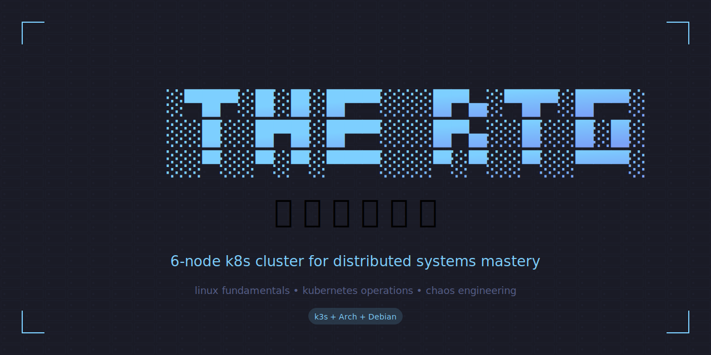

<p align="center">
  
</p>

<p align="center">
  <em>Linux fundamentals • Kubernetes operations • Chaos engineering</em>
</p>

<p align="center">
  <a href="docs/order-sheet.md">Order Sheet</a> •
  <a href="docs/learning-track.md">Learning Track</a> •
  <a href="docs/architecture.md">Architecture</a> •
  <a href="https://tools.oceanheart.ai">all tools</a>
</p>

<p align="center">
  <code>theory is comfortable.</code><br />
  <code><strong>this is practice.</strong></code>
</p>

---

A 6-node Kubernetes cluster built for one purpose: to stop being someone who *talks about* distributed systems and become someone who *operates* them.

This isn't a tutorial. It's a crucible.

## The Premise

Sold the Alienware. Bought six refurbished mini PCs from strangers on eBay. Racked them on a shelf. Installed three different Linux distros because homogeneity is for cowards. Now there's a cluster in the corner that either teaches me everything or collects dust as an expensive monument to ambition.

The cluster doesn't care which.

## The Topology

```
┌─────────────────────────────────────────────────────────────┐
│                      THE COCKPIT                            │
│  Ryzen 7 6800H · Hyprland · tmux · kubectl                 │
│  Two ultrawides. Zero excuses.                              │
└─────────────────────────────┬───────────────────────────────┘
                              │
                         2.5GbE switch
                              │
        ┌─────────────────────┼─────────────────────┐
        │                     │                     │
   ┌────┴────┐          ┌─────┴─────┐         ┌────┴────┐
   │  cp-1   │          │   cp-2    │         │  cp-3   │
   │ Debian  │          │  Debian   │         │ Debian  │
   │  etcd   │          │   etcd    │         │  etcd   │
   └─────────┘          └───────────┘         └─────────┘
        │                     │                     │
   ┌────┴────┐          ┌─────┴─────┐         ┌────┴────┐
   │  wk-1   │          │   wk-2    │         │  wk-3   │
   │  Arch   │          │  Ubuntu   │         │  Arch   │
   │  chaos  │          │ corporate │         │  chaos  │
   └─────────┘          └───────────┘         └─────────┘
```

*Three control plane nodes for HA. Three workers for workloads. Mixed distros because real clusters are heterogeneous and learning on training wheels helps no one.*

## Documentation

| Document | What It Contains |
|----------|------------------|
| [Order Sheet](docs/order-sheet.md) | Complete shopping list with eBay/Amazon links |
| [Learning Track](docs/learning-track.md) | 8-week curriculum from Arch install to chaos engineering |
| [Architecture](docs/architecture.md) | Network topology, node roles, failure domains |
| [Air-Gap Kit](docs/air-gap-kit.md) | Offline resources for when Google isn't an option |
| [Learning Log](docs/learning-log.md) | Daily proof of work |

## The Goals

1. **Linux from the metal up** — Arch manual install, LFS build, no GUI installers, no safety nets
2. **Distributed systems intuition** — The kind you only get from watching a pod fail to reschedule at 2am
3. **Operational muscle memory** — kubectl, etcdctl, systemctl until they're reflex
4. **Career signal** — Not "I did a tutorial" but "I operate a cluster"

## Progress

```
□ Order hardware
□ Download air-gap survival kit
□ Week 1: Arch manual install (X230)
□ Week 1-2: OverTheWire Bandit wargames
□ Week 2-3: LFS build (air-gapped)
□ Week 4: Hardware arrives, rack it
□ Week 5: k3s cluster bootstrap
□ Week 6+: Break everything, fix everything
```

## Learning in Public

Weekly updates in [learning-log.md](docs/learning-log.md).

The ego wants to wait until it's polished. The practice is to ship it rough.

## License

MIT

---

*Born 2026-02-15. Named by necessity. Promised not to stay theoretical.*
